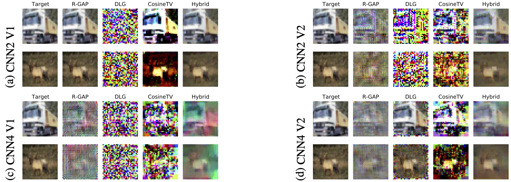

# Analysing Training-Data Leakage from Gradients through Linear Systems and Gradient Matching [[paper]](https://arxiv.org/abs/2210.13231)

## Abstract
Recent works have demonstrated that it is possible to reconstruct training images and their labels from gradients of an image-classification model when its architecture is known. Unfortunately, there is still an incomplete theoretical understanding of the efficacy and failure of these gradient-leakage attacks. In this paper, we propose a novel framework to analyse training-data leakage from gradients that draws insights from both analytic and optimisation-based gradient-leakage attacks. We formulate the reconstruction problem as solving a linear system from each layer iteratively, accompanied by corrections using gradient matching. Under this framework, we claim that the solubility of the reconstruction problem is primarily determined by that of the linear system at each layer. As a result, we are able to partially attribute the leakage of the training data in a deep network to its architecture. We also propose a metric to measure the level of security of a deep learning model against gradient-based attacks on the training data. 

## Summary of the hybrid method
<p align="center">
    
</p>

## Comparison with previous methods
We provide some examples here. Our method is labelled as 'Hybrid'. For details and more examples, please refer to the paper.
<p align="center">
    
</p>

## Implementation
We have attached all the code used to produce the comparison results from our paper. To reproduce the results, please follow the instructions below:

1. setting up the conda environment using the yml file provided:

```
conda env create -f environment.yml
```

2. specify the output and data paths in lines 940 and 941 of hybrid.py:
```
output_path = '' # path for saving the plots
data_path = '' #  path to the CIFAR10 dataset; It will be downloaded if it does not exist
```

3. With the conda environment created by the yml file activated, run 
```
python hybrid.py
```
If you have multiple GPUs, you can specify which GPU to run the script by adding 
```
CUDA_VISIBLE_DEVICES=x.  # x = 0, 1, ...
```
at the beginning of the command.

4. The result of the comparison will be saved as a png file which includes PSNR scores and reconstructed images.


## Citation
```
@inproceedings{ChenAnalysingTrainingDataLeakage2022,
  title={Analysing Training-Data Leakage from Gradients through Linear Systems and Gradient Matching},
  author={Chen, Cangxiong and Campbell, Neill D. F.},
  booktitle={The 33rd British Machine Vision Conference (BMVC)},
  year={2022}
}
```

## License

This work is licensed under a [Creative Commons Attribution 4.0 International License](https://creativecommons.org/licenses/by/4.0/).
