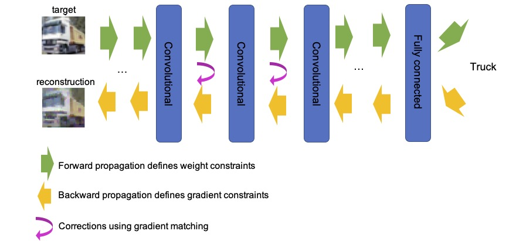

# Analysing Training-Data Leakage from Gradients through Linear Systems and Gradient Matching [[paper]](https://arxiv.org/abs/2210.13231)

## Abstract
Recent works have demonstrated that it is possible to reconstruct training images and their labels from gradients of an image-classification model when its architecture is known. Unfortunately, there is still an incomplete theoretical understanding of the efficacy and failure of these gradient-leakage attacks. In this paper, we propose a novel framework to analyse training-data leakage from gradients that draws insights from both analytic and optimisation-based gradient-leakage attacks. We formulate the reconstruction problem as solving a linear system from each layer iteratively, accompanied by corrections using gradient matching. Under this framework, we claim that the solubility of the reconstruction problem is primarily determined by that of the linear system at each layer. As a result, we are able to partially attribute the leakage of the training data in a deep network to its architecture. We also propose a metric to measure the level of security of a deep learning model against gradient-based attacks on the training data. 

## Summary of the hybrid method
<p align="center">
    
</p>

## Citation
```
@inproceedings{ChenAnalysingTrainingDataLeakage2022,
  title={Analysing Training-Data Leakage from Gradients through Linear Systems and Gradient Matching},
  author={Chen, Cangxiong and Campbell, Neill D. F.},
  booktitle={The 33rd British Machine Vision Conference (BMVC)},
  year={2022}
}
```
